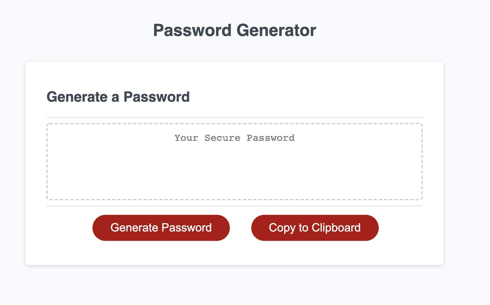

# Password Generator

when prompted the user will need to enter the applicable value. 
the length must be from 8 - 128 charcters
One must select at least 1 of the applicable character fields as well. 

If the values are not entered correctly as prompted the password generator will not finalize.

Special Characters are defined based on the following reference:  [list of Password Special Characters from the OWASP Foundation](https://www.owasp.org/index.php/Password_special_characters).

# Assets

[The Production URL is as Follows](https://www.owasp.org/index.php/Password_special_characters).